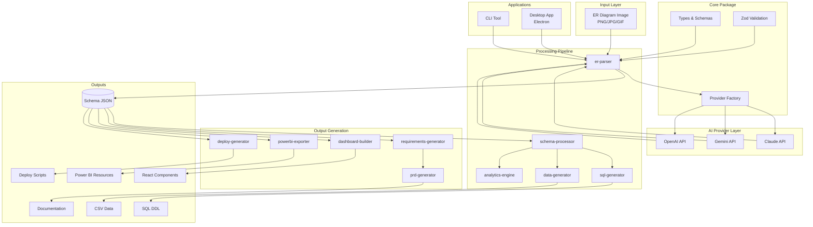
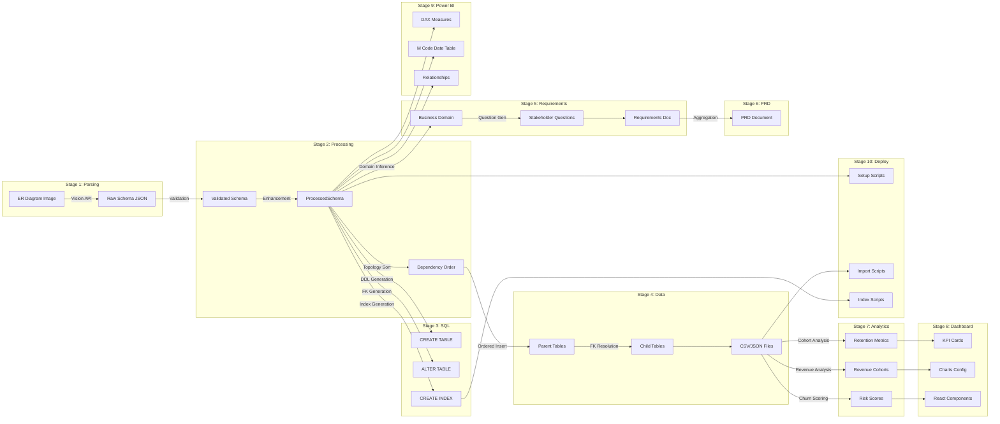
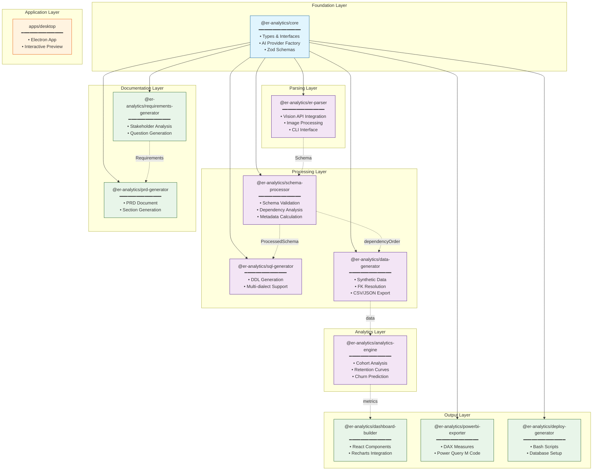

# Section 3: ARCHITECTURE ANALYSIS

## 3.1 Architecture Patterns Identified

### 3.1.1 Monorepo Architecture
The project uses a **pnpm workspace monorepo** structure, enabling:
- Shared dependencies across packages
- Workspace protocol for internal package references (`workspace:*`)
- Unified build and test orchestration via root `package.json`

**Configuration**: `pnpm-workspace.yaml`
```yaml
packages:
  - 'packages/*'
  - 'apps/*'
```

### 3.1.2 Pipeline Architecture
The system implements an **11-stage transformation pipeline** that sequentially processes data from ER diagram input to deployable analytics platform:

| Stage | Package | Purpose |
|-------|---------|---------|
| 1 | er-parser | Vision AI parsing of ER diagrams |
| 2 | schema-processor | Schema validation and enhancement |
| 3 | sql-generator | DDL generation (PostgreSQL/MySQL/SQLite) |
| 4 | data-generator | Synthetic data generation |
| 5 | requirements-generator | Business requirements documentation |
| 6 | prd-generator | Product requirements document |
| 7 | analytics-engine | Cohort analysis and metrics |
| 8 | dashboard-builder | React dashboard components |
| 9 | powerbi-exporter | Power BI resources (DAX, M code) |
| 10 | deploy-generator | Deployment scripts |
| 11 | desktop (app) | Interactive preview application |

### 3.1.3 Layered Architecture
The codebase follows a three-tier layered structure:

| Layer | Packages | Responsibility |
|-------|----------|----------------|
| **Core Layer** | `core` | Types, AI provider abstraction, utilities |
| **Processing Layer** | `er-parser`, `schema-processor`, `sql-generator`, `data-generator`, `analytics-engine` | Data transformation and analysis |
| **Presentation Layer** | `dashboard-builder`, `powerbi-exporter`, `prd-generator`, `requirements-generator`, `deploy-generator` | Output generation |

### 3.1.4 Multi-Provider Abstraction
The system supports multiple GenAI providers (Claude, Gemini, OpenAI) through a unified interface, allowing runtime provider switching without code changes.

---

## 3.2 Design Patterns in Use

### 3.2.1 Factory Pattern
**Location**: `packages/core/src/ai-providers/index.ts`

Creates AI provider instances based on configuration:
```typescript
export function createProvider(config: AIProviderConfig): AIProvider {
  switch (config.provider) {
    case 'claude': return new ClaudeProvider(config.apiKey, config.model);
    case 'gemini': return new GeminiProvider(config.apiKey, config.model);
    case 'openai': return new OpenAIProvider(config.apiKey, config.model);
    default: throw new Error(`Unknown AI provider: ${config.provider}`);
  }
}
```

### 3.2.2 Strategy Pattern
**Location**: `packages/core/src/ai-providers/*.ts`

Multiple AI providers implement the same `AIProvider` interface:
```typescript
export interface AIProvider {
  name: AIProviderName;
  parseERDiagram(imageBuffer: Buffer, mimeType: string): Promise<VisionParseResult>;
  generateText(prompt: string, options?: TextGenerationOptions): Promise<string>;
}
```

**Implementations**:
- `ClaudeProvider` → `packages/core/src/ai-providers/claude.ts`
- `GeminiProvider` → `packages/core/src/ai-providers/gemini.ts`
- `OpenAIProvider` → `packages/core/src/ai-providers/openai.ts`

### 3.2.3 Builder Pattern
**Location**: `packages/dashboard-builder/src/index.ts`

Constructs complex React dashboard components from configuration:
```typescript
export function generateDashboardComponent(config: DashboardConfig): string {
  // Builds complete React component with KPIs, charts, and styling
}
```

### 3.2.4 Template Method Pattern
**Location**: `packages/sql-generator/src/index.ts`

Defines SQL generation skeleton with dialect-specific variations:
```typescript
function mapDataType(type: string, dialect: DatabaseDialect): string {
  if (dialect === 'postgresql') { /* PostgreSQL mapping */ }
  if (dialect === 'mysql') { /* MySQL mapping */ }
  return type;
}
```

### 3.2.5 Facade Pattern
**Location**: Each package's `index.ts`

Each package exposes a simplified API hiding internal complexity:
- `parseERDiagram()` → `packages/er-parser/src/index.ts`
- `processSchema()` → `packages/schema-processor/src/index.ts`
- `generateSQL()` → `packages/sql-generator/src/index.ts`
- `generateData()` → `packages/data-generator/src/index.ts`

### 3.2.6 Dependency Injection
**Location**: `packages/er-parser/src/index.ts`

Provider is injected through options rather than hardcoded:
```typescript
export async function parseERDiagram(
  imagePath: string,
  options: ParseOptions = {}
): Promise<VisionParseResult> {
  const provider = options.provider 
    ? createProvider(options.provider)
    : getProviderFromEnv();
  // ...
}
```

### 3.2.7 Schema Validation (Zod)
**Location**: `packages/core/src/types/index.ts`

Runtime type validation using Zod schemas:
```typescript
export const DatabaseSchema = z.object({
  tables: z.array(TableSchema),
  metadata: z.object({...}).optional(),
  dependencyOrder: z.array(z.string()).optional(),
});
```

---

## 3.3 Component/Module Relationships

### Package Dependencies

| Package | Dependencies |
|---------|--------------|
| `@er-analytics/core` | External only (Anthropic, Google AI, OpenAI, Zod) |
| `@er-analytics/er-parser` | `@er-analytics/core` |
| `@er-analytics/schema-processor` | `@er-analytics/core` |
| `@er-analytics/sql-generator` | `@er-analytics/core` |
| `@er-analytics/data-generator` | `@er-analytics/core` |
| `@er-analytics/requirements-generator` | `@er-analytics/core` |
| `@er-analytics/prd-generator` | `@er-analytics/core` |
| `@er-analytics/analytics-engine` | None (standalone algorithms) |
| `@er-analytics/dashboard-builder` | None (code generation) |
| `@er-analytics/powerbi-exporter` | `@er-analytics/core` |
| `@er-analytics/deploy-generator` | `@er-analytics/core` |

### Data Flow Dependencies
The pipeline stages have implicit data dependencies:
1. **er-parser** outputs `Schema` → consumed by all subsequent stages
2. **schema-processor** outputs `ProcessedSchema` with `dependencyOrder` → required by **data-generator**
3. **requirements-generator** outputs `RequirementsDocument` → consumed by **prd-generator**
4. **analytics-engine** outputs `AnalyticsResult` → consumed by dashboards

---

## 3.4 Mermaid Diagrams

### 3.4.1 System Architecture Overview



### 3.4.2 Data Flow Through the System



### 3.4.3 Module Dependencies



---

## 3.5 Key Architectural Decisions

| Decision | Rationale |
|----------|-----------|
| **Monorepo with pnpm** | Enables code sharing, atomic changes, and simplified dependency management |
| **Pipeline Architecture** | Natural fit for sequential transformation workflow with clear stage boundaries |
| **Provider Abstraction** | Allows switching between Claude/Gemini/OpenAI without code changes |
| **Zod for Validation** | Runtime type safety for AI-generated JSON with TypeScript inference |
| **Standalone Analytics Engine** | Pure algorithms without external dependencies for testability |
| **Code Generation over Runtime** | Dashboard components generated as source code for customization |
| **Multi-dialect SQL** | Single codebase supports PostgreSQL, MySQL, and SQLite |

---

## 3.6 Extension Points

1. **New AI Providers**: Implement `AIProvider` interface and add to factory
2. **New Database Dialects**: Extend `DatabaseDialect` type and add mapping in `sql-generator`
3. **New Dashboard Types**: Add configuration to `getDefaultDashboardConfigs()`
4. **Custom Pipeline Stages**: Create new package following existing conventions
5. **Additional Export Formats**: Add exporters following `powerbi-exporter` pattern
